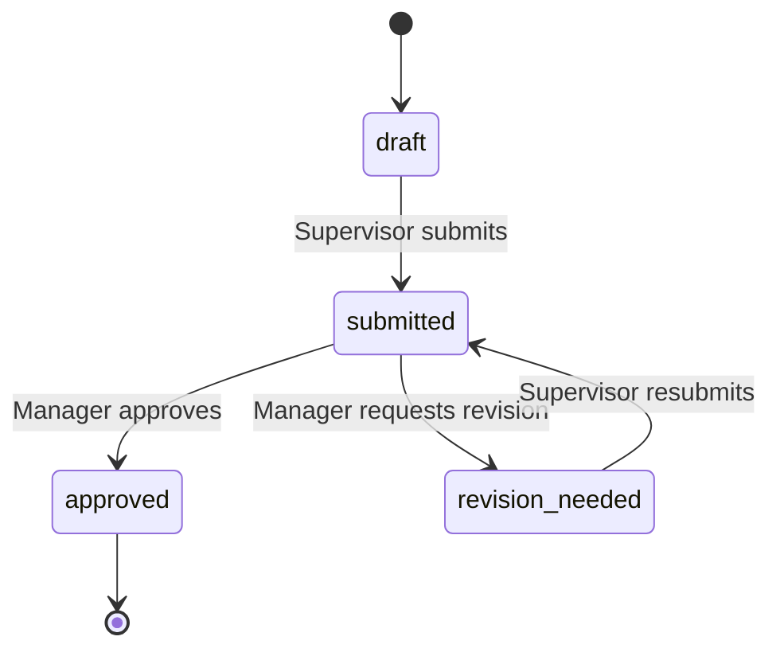

# OpenAPI Schema Updates - Nursery Management System v2.0.0
## Minimal Diff Showing New/Changed Schemas and Endpoints

---

## 1. Updated Schemas

### 1.1 DailyReportCreate (NEW fields)

```yaml
DailyReportCreate:
  type: object
  required:
    - child_id
    - date
    - supervisor_id  # NEW - REQUIRED
  properties:
    child_id:
      type: integer
      format: int32
    date:
      type: string
      format: date
    supervisor_id:  # NEW
      type: integer
      format: int32
      description: ID of supervisor creating the report
    status:  # NEW
      type: string
      enum: [draft, submitted, approved, revision_needed]
      default: submitted
      description: Report workflow status
    meals:
      type: string
    nap_duration:
      type: string
    bathroom_visits:
      type: integer
    mood:
      type: string
    activities:
      type: string
    notes:
      type: string
```

### 1.2 DailyReportResponse (NEW fields)

```yaml
DailyReportResponse:
  allOf:
    - $ref: '#/components/schemas/DailyReportCreate'
    - type: object
      properties:
        id:
          type: integer
        status:  # NEW
          type: string
          enum: [draft, submitted, approved, revision_needed]
        manager_notes:  # NEW
          type: string
          nullable: true
          description: Manager feedback for revision requests
        reviewed_by:  # NEW
          type: integer
          nullable: true
          description: Manager ID who reviewed the report
        reviewed_at:  # NEW
          type: string
          format: date-time
          nullable: true
        created_at:
          type: string
          format: date-time
        updated_at:
          type: string
          format: date-time
```

### 1.3 DailyReportUpdate (NEW)

```yaml
DailyReportUpdate:
  type: object
  properties:
    meals:
      type: string
    nap_duration:
      type: string
    bathroom_visits:
      type: integer
    mood:
      type: string
    activities:
      type: string
    notes:
      type: string
    status:  # NEW
      type: string
      enum: [draft, submitted, approved, revision_needed]
    manager_notes:  # NEW
      type: string
```

### 1.4 ClassroomCreate (NEW fields)

```yaml
ClassroomCreate:
  type: object
  required:
    - branch_id
    - name
    - capacity
  properties:
    branch_id:
      type: integer
    name:
      type: string
    capacity:
      type: integer
      minimum: 1
    supervisor_id:  # NEW
      type: integer
      nullable: true
      description: Assigned supervisor for this classroom
    min_age_days:  # NEW
      type: integer
      minimum: 0
      default: 0
      description: Minimum age in days (0 = newborn)
    max_age_months:  # NEW
      type: integer
      minimum: 1
      maximum: 72
      default: 60
      description: Maximum age in months (60 = 5 years)
    is_active:  # NEW
      type: boolean
      default: true
      description: Whether classroom accepts new enrollments
```

### 1.5 ClassroomResponse (NEW fields)

```yaml
ClassroomResponse:
  allOf:
    - $ref: '#/components/schemas/ClassroomCreate'
    - type: object
      properties:
        id:
          type: integer
        current_enrollment:  # NEW (computed)
          type: integer
          description: Current number of active children
        available_spots:  # NEW (computed)
          type: integer
          description: Remaining capacity
        utilization_percent:  # NEW (computed)
          type: number
          format: float
        created_at:
          type: string
          format: date-time
        updated_at:
          type: string
          format: date-time
```

### 1.6 NotificationCreate (NEW fields)

```yaml
NotificationCreate:
  type: object
  required:
    - user_id
    - title
    - message
  properties:
    user_id:
      type: integer
    title:
      type: string
    message:
      type: string
    type:
      type: string
      enum: [info, success, warning, error]
      default: info
    link:
      type: string
      nullable: true
    nursery_id:  # NEW
      type: integer
      nullable: true
      description: Scope notification to specific nursery (NULL = system-wide)
    target_role:  # NEW
      type: string
      enum: [admin, manager, supervisor, parent]
      nullable: true
      description: Target role for broadcast notifications
```

### 1.7 AttendanceCreate (NEW field)

```yaml
AttendanceCreate:
  type: object
  required:
    - child_id
    - date
    - status
  properties:
    child_id:
      type: integer
    date:
      type: string
      format: date
    status:
      type: string
      enum: [present, absent, late]
    check_in_time:
      type: string
      format: time
    check_out_time:
      type: string
      format: time
    notes:  # NEW
      type: string
      nullable: true
      description: Additional context (illness, late reason, etc.)
```

### 1.8 UserResponse (NEW fields)

```yaml
UserResponse:
  type: object
  properties:
    id:
      type: integer
    email:
      type: string
    first_name:
      type: string
    last_name:
      type: string
    role:
      type: string
      enum: [admin, manager, supervisor, parent]
    nursery_id:
      type: integer
      nullable: true
    branch_id:  # NEW
      type: integer
      nullable: true
      description: Assigned branch for supervisors
    is_active:
      type: boolean
    last_login:  # NEW
      type: string
      format: date-time
      nullable: true
    temp_password:  # NEW (only in create response)
      type: string
      nullable: true
      description: Temporary password shown once after account creation
    created_at:
      type: string
      format: date-time
```

### 1.9 RevisionRequest (NEW)

```yaml
RevisionRequest:
  type: object
  required:
    - manager_notes
  properties:
    manager_notes:
      type: string
      description: Feedback explaining what needs revision
```

### 1.10 CapacityCheckResponse (NEW)

```yaml
CapacityCheckResponse:
  type: object
  properties:
    has_capacity:
      type: boolean
    current_enrollment:
      type: integer
    max_capacity:
      type: integer
    available_spots:
      type: integer
```

---

## 2. New Endpoints

### 2.1 Daily Reports - Status Transitions

```yaml
PUT /manager/reports/{report_id}/approve:
  summary: Approve a daily report
  tags: [Manager, Reports]
  security:
    - bearerAuth: []
  parameters:
    - name: report_id
      in: path
      required: true
      schema:
        type: integer
  responses:
    200:
      description: Report approved successfully
      content:
        application/json:
          schema:
            $ref: '#/components/schemas/DailyReportResponse'
    403:
      description: Not authorized (report not in your nursery)
    404:
      description: Report not found
    422:
      description: Invalid status transition (must be 'submitted')

PUT /manager/reports/{report_id}/revise:
  summary: Request revision on a daily report
  tags: [Manager, Reports]
  security:
    - bearerAuth: []
  parameters:
    - name: report_id
      in: path
      required: true
      schema:
        type: integer
  requestBody:
    required: true
    content:
      application/json:
        schema:
          $ref: '#/components/schemas/RevisionRequest'
  responses:
    200:
      description: Revision requested successfully
      content:
        application/json:
          schema:
            $ref: '#/components/schemas/DailyReportResponse'
    403:
      description: Not authorized
    404:
      description: Report not found
    422:
      description: Invalid status transition

PUT /supervisor/reports/{report_id}/resubmit:
  summary: Resubmit a report after revision
  tags: [Supervisor, Reports]
  security:
    - bearerAuth: []
  parameters:
    - name: report_id
      in: path
      required: true
      schema:
        type: integer
  requestBody:
    required: true
    content:
      application/json:
        schema:
          $ref: '#/components/schemas/DailyReportUpdate'
  responses:
    200:
      description: Report resubmitted successfully
      content:
        application/json:
          schema:
            $ref: '#/components/schemas/DailyReportResponse'
    403:
      description: Not authorized (not your report or wrong status)
    422:
      description: Invalid status transition
```

### 2.2 Classroom - Capacity Checks

```yaml
GET /classrooms/{classroom_id}/capacity:
  summary: Check classroom capacity availability
  tags: [Classrooms]
  security:
    - bearerAuth: []
  parameters:
    - name: classroom_id
      in: path
      required: true
      schema:
        type: integer
  responses:
    200:
      description: Capacity information
      content:
        application/json:
          schema:
            $ref: '#/components/schemas/CapacityCheckResponse'
    403:
      description: Not authorized to view this classroom
    404:
      description: Classroom not found

GET /manager/classrooms/capacity-report:
  summary: Get capacity utilization for all classrooms in nursery
  tags: [Manager, Classrooms]
  security:
    - bearerAuth: []
  responses:
    200:
      description: Capacity report for all classrooms
      content:
        application/json:
          schema:
            type: array
            items:
              $ref: '#/components/schemas/ClassroomResponse'
```

### 2.3 Notifications - Nursery-Scoped Broadcast

```yaml
POST /manager/notifications/broadcast:
  summary: Broadcast notification to users in manager's nursery
  tags: [Manager, Notifications]
  security:
    - bearerAuth: []
  requestBody:
    required: true
    content:
      application/json:
        schema:
          type: object
          required:
            - title
            - message
          properties:
            title:
              type: string
            message:
              type: string
            type:
              type: string
              enum: [info, success, warning, error]
              default: info
            target_role:
              type: string
              enum: [supervisor, parent]
              description: Filter recipients by role (null = all roles in nursery)
  responses:
    200:
      description: Notification broadcast successfully
      content:
        application/json:
          schema:
            type: object
            properties:
              message:
                type: string
              recipients_count:
                type: integer
    400:
      description: Invalid request
    403:
      description: Not authorized to broadcast
```

### 2.4 Supervisor - Performance Metrics

```yaml
GET /manager/supervisors/{supervisor_id}/performance:
  summary: Get performance metrics for a supervisor
  tags: [Manager, Supervisors]
  security:
    - bearerAuth: []
  parameters:
    - name: supervisor_id
      in: path
      required: true
      schema:
        type: integer
    - name: start_date
      in: query
      required: false
      schema:
        type: string
        format: date
      description: Start date for metrics (default: 30 days ago)
    - name: end_date
      in: query
      required: false
      schema:
        type: string
        format: date
      description: End date for metrics (default: today)
  responses:
    200:
      description: Supervisor performance metrics
      content:
        application/json:
          schema:
            type: object
            properties:
              supervisor_id:
                type: integer
              supervisor_name:
                type: string
              email:
                type: string
              total_reports:
                type: integer
              pending_reports:
                type: integer
              approved_reports:
                type: integer
              revision_requests:
                type: integer
              classrooms_assigned:
                type: integer
              children_supervised:
                type: integer
              last_login:
                type: string
                format: date-time
    403:
      description: Supervisor not in your nursery
    404:
      description: Supervisor not found
```

---

## 3. Modified Endpoints (Breaking Changes)

### 3.1 POST /reports/ (Supervisor creates report)

**CHANGED: Now requires supervisor_id in request body**

```yaml
POST /reports/:
  requestBody:
    required: true
    content:
      application/json:
        schema:
          $ref: '#/components/schemas/DailyReportCreate'  # Now includes supervisor_id
  responses:
    201:
      description: Report created with status='submitted'
    400:
      description: Duplicate report (child_id + date already exists)
    422:
      description: Validation error
```

### 3.2 POST /children/ (Admin/Manager creates child)

**CHANGED: Now validates capacity and age constraints**

```yaml
POST /children/:
  responses:
    201:
      description: Child created successfully
    400:
      description: |
        Business rule violation:
        - Classroom is at full capacity
        - Child is too young for classroom (min_age_days)
        - Child is too old for classroom (max_age_months)
        - Classroom is inactive
    404:
      description: Parent or classroom not found
```

### 3.3 PUT /children/{child_id} (Transfer child)

**CHANGED: Now validates capacity and age constraints for target classroom**

```yaml
PUT /children/{child_id}:
  responses:
    200:
      description: Child updated successfully
    400:
      description: |
        Business rule violation:
        - Target classroom is at full capacity
        - Child is too young for target classroom
        - Child is too old for target classroom
        - Target classroom is inactive
    404:
      description: Child or classroom not found
```

---

## 4. Query Parameter Changes

### 4.1 GET /reports/my-nursery/

**NEW query parameter: status**

```yaml
parameters:
  - name: status
    in: query
    required: false
    schema:
      type: string
      enum: [draft, submitted, approved, revision_needed]
    description: Filter reports by workflow status
```

### 4.2 GET /manager/reports

**NEW query parameter: status (same as above)**

---

## 5. Status Code Changes

### 5.1 New Error Codes

```yaml
422 Unprocessable Entity:
  description: |
    Business rule validation failed:
    - Invalid status transition
    - Age constraint violation
    - Capacity constraint violation
    
  content:
    application/json:
      schema:
        type: object
        properties:
          detail:
            type: string
            examples:
              - "Cannot transition from 'approved' to 'draft'"
              - "Child is too young for this classroom (minimum 365 days)"
              - "Classroom is at full capacity (30/30)"
```

---

## 6. Enum Updates

### 6.1 DailyReportStatus (NEW)

```yaml
DailyReportStatus:
  type: string
  enum:
    - draft        # Supervisor is still editing
    - submitted    # Sent to manager for review
    - approved     # Manager approved
    - revision_needed  # Manager requested changes
```

### 6.2 NotificationType (existing, confirmed)

```yaml
NotificationType:
  type: string
  enum: [info, success, warning, error]
```

---

## 7. Authorization Rules (Per Endpoint)

| Endpoint | Required Role | Additional Check |
|----------|--------------|------------------|
| `POST /reports/` | supervisor | `supervisor_id` must match `current_user.id` |
| `PUT /manager/reports/{id}/approve` | manager | Report's `nursery_id` must match `current_user.nursery_id` |
| `PUT /manager/reports/{id}/revise` | manager | Same as approve |
| `PUT /supervisor/reports/{id}/resubmit` | supervisor | Report's `supervisor_id` must match `current_user.id` AND `status='revision_needed'` |
| `POST /manager/notifications/broadcast` | manager | Recipients filtered to `current_user.nursery_id` |
| `GET /manager/supervisors/{id}/performance` | manager | Supervisor's `nursery_id` must match `current_user.nursery_id` |
| `POST /children/` | admin, manager | Parent must be in same nursery (if manager) |
| `PUT /children/{id}` | admin, manager | Child must be in same nursery (if manager) |

---

## 8. Backward Compatibility Notes

**Breaking Changes:**
1. `POST /reports/` now requires `supervisor_id` in request body
2. `POST /children/` and `PUT /children/{id}` now enforce capacity and age constraints (may return 400 instead of 201/200)
3. `DailyReportResponse` includes new fields (`status`, `manager_notes`, `reviewed_by`, `reviewed_at`)

**Mitigation:**
- Existing clients must add `supervisor_id: current_user.id` to report creation requests
- Existing clients should handle new 400 error responses for capacity/age violations
- New response fields are additive and can be safely ignored by old clients

**Non-Breaking Changes:**
- New endpoints are additive (no existing endpoints removed)
- New query parameters are optional
- New response fields are nullable or have defaults

---

## 9. Example Workflows

### 9.1 Report Approval Workflow



**API Calls:**

1. **Supervisor creates draft:**
   ```
   POST /reports/
   { "child_id": 15, "date": "2025-11-02", "supervisor_id": 5, "status": "draft", ... }
   ```

2. **Supervisor submits:**
   ```
   PUT /reports/123
   { "status": "submitted" }
   ```

3. **Manager approves:**
   ```
   PUT /manager/reports/123/approve
   ```

4. **OR Manager requests revision:**
   ```
   PUT /manager/reports/123/revise
   { "manager_notes": "Please add more details about behavior incident." }
   ```

5. **Supervisor resubmits:**
   ```
   PUT /supervisor/reports/123/resubmit
   { "notes": "Updated with details...", "status": "submitted" }
   ```

### 9.2 Child Registration with Validation

```
POST /children/
{
  "first_name": "Layla",
  "last_name": "Hassan",
  "date_of_birth": "2023-06-15",
  "classroom_id": 5,
  "parent_id": 10
}

# If classroom full:
400 Bad Request
{ "detail": "Classroom is at full capacity (25/25)" }

# If child too young:
400 Bad Request
{ "detail": "Child is too young for this classroom (minimum 730 days, child is 500 days old)" }

# If success:
201 Created
{ "id": 50, "first_name": "Layla", ... }
```

---

**Document Version:** 2.0.0  
**Last Updated:** 2025-11-02  
**Status:** Production Ready
